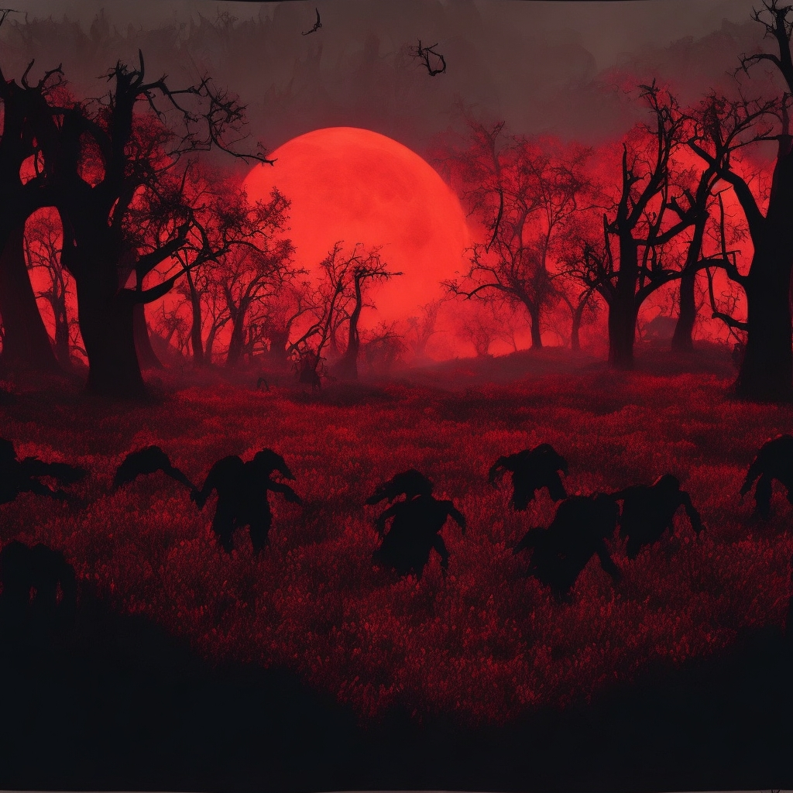

# Ghoul Slayer

#### By Owen Brown

## Description
This is a thrilling full-fledged first-person shooter developed in Unreal Engine, utilizing Blueprints for gameplay mechanics and incorporating various features such as AI, a vast landscape, smooth animations, and more. The game is designed around wave-based enemies that relentlessly chase and attack you, providing an intense and immersive gaming experience. 

* Note that this game is still in alpha, so while it is playable and contains all the major features, these features may be further revised based on testing and feedback.  

## Technologies Used

* Unreal Engine: The game engine used to develop the entire game, providing the core framework, rendering, physics, and other essential functionalities.
* Blueprints: Unreal Engine's visual scripting system used to create gameplay mechanics, AI behaviors, and interactions within the game.
* AI (Artificial Intelligence): AI systems and algorithms implemented to control enemy behavior, pathfinding, decision-making, and enemy-player interactions.
* Asset Creation Tools (3D modeling, texturing, etc.): Mixamo, Unreal Engine Marketplace Assets
* Version Control System: Git

## Key Features

* Immersive First-Person Shooter Experience: Step into the shoes of a fearless warrior, ready to take on wave after wave of enemies in heart-pounding battles.
* AI Enemies: Encounter intelligent and challenging enemies that actively seek you out, providing a formidable challenge that tests your skills.
* Landscaping: Explore visually stunning landscapes, carefully crafted to immerse you in the game's world and enhance the overall gaming experience.
* Engaging Animations: Experience smooth and realistic animations for characters, weapons, and various interactions, further enhancing the game's immersion.
* Wave-based Gameplay: Face increasingly difficult waves of enemies, each posing a unique threat and requiring strategic thinking and quick reflexes to overcome.
* Stunning Visuals and Audio: Feast your eyes on stunning visuals and immerse yourself in a rich soundscape that brings the game world to life.

### Setup Instructions...

#### You Will Need: 

* Unreal Engine Installed
* Windows installed

#### Preliminary Project Set-up:
1. Locate Windows.zip in the repo and click "View raw."
2. Open the downloaded folder and open "ProjectFPS.exe."
3. Click "Extract All" and choose the destination you want to open the file in.
4. Locate that file and Click "ProjectFPS.exe."
5. A Windows prompt may appear for you to check security, simply click "More info" and "Run Anyway" and the game will start.

## Known Bugs

* Enemies sometimes stop attacking and give up

## License
Enjoy the game! If you have questions or suggestions for fixing the code, please contact me!